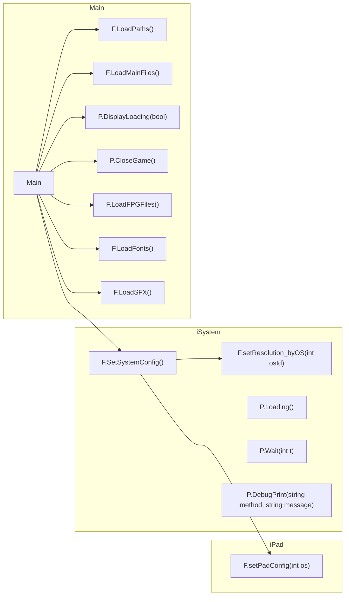

```mermaid
graph LR;
  	subgraph iPad
    ipF2["F.setPadConfig(int os)"]
    end
    subgraph iSystem
    isF1["F.SetSystemConfig()"]
    isF2["F.setResolution_byOS(int osId)"]
    isF1 --> isF2
    isF1 --> ipF2
    isF3["P.Loading()"]
    isF4["P.Wait(int t)"]
    isF5["P.DebugPrint(string method, string message)"]
    end
    subgraph Main
    A[Main] --> F1["F.LoadPaths()"]
    A[Main] --> F2["F.LoadMainFiles()"]
    A[Main] --> F3["P.DisplayLoading(bool)"]
    A[Main] --> F4["P.CloseGame()"]
    A[Main] --> isF1
    A[Main] --> F5["F.LoadFPGFiles()"]
    A[Main] --> F6["F.LoadFonts()"]
    A[Main] --> F7["F.LoadSFX()"]
    end
 
```

